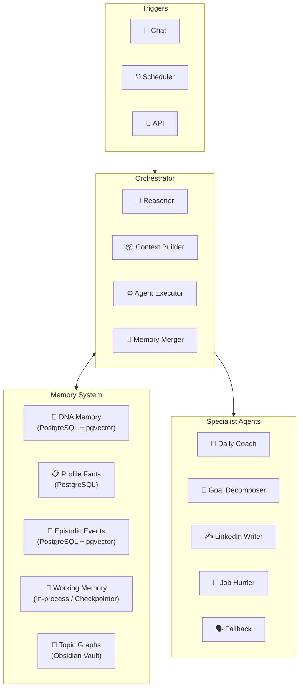

# 🏛️ Architecture Overview

> **Role:** The high-level system design document describing how the Personal AI Mentor works as a whole.

---

## System Philosophy

The Personal AI Mentor is a **local-first, multi-agent AI companion** built on these core principles (from `mentor_agent_guidelines.md` §2):

1. **One identity, many domains.** Every domain agent draws from and updates the *same* underlying picture of who you are. No domain gets its own private, fragmented memory.
2. **Specificity over genericity.** No agent generates from vague prompts. The context assembler forces concrete, specific inputs before generation ever happens.
3. **Proactive, not just reactive.** The system can initiate contact (check-ins, nudges, reflections) on a schedule, not only respond to messages.
4. **Local-first, privacy by default.** All personal data — memory, goals, reflections — is stored on your own machine.
5. **Earn trust in low-stakes domains before high-stakes ones.** Build and prove the foundation on safe domains first.

## High-Level Data Flow

## Stateless Agents, Stateful Memory

The defining architectural decision: **sub-agents are stateless**. They never read or write the database directly. Instead:

1. The orchestrator reads memory → builds a `MemorySlice` (trimmed context)
2. Sends it to the sub-agent as an `AgentTask`
3. The sub-agent returns an `AgentResult` with a `memory_delta`
4. The orchestrator merges the delta into the persistent memory store

This means:
- Adding a new agent never requires DB access patterns — just a new entry in the [[Agent IO Contract]]
- Memory consistency is enforced in one place (the orchestrator's `memory_merger_node`)
- Agents can be tested in isolation with mock memory slices

## Entry Points

The system can be triggered three ways, all entering the same LangGraph state graph:

| Trigger | Source | Description |
|---------|--------|-------------|
| Chat | `💬` Web UI / CLI | User sends a message directly |
| Scheduler | `⏰` AP Scheduler | Time-based proactive check-ins, nudges |
| API | `📡` FastAPI | Programmatic access via REST endpoints |

## LLM Model Strategy

Three-tier model selection (`orchestrator/llm.py`):

| Tier | Model | Purpose | Latency |
|------|-------|---------|---------|
| Router | `gpt-4o-mini` | Fast routing, classification, reflection | ~1s |
| Converser | `Qwen/Qwen3-235B-A22B-Instruct` (Nebius) | Direct mentor responses, high-quality reasoning | ~3-5s |
| Writer | `MiniMaxAI/MiniMax-M3` (Nebius) | Deep content generation, tutorials, drafts | ~5-10s |

## Key Design Decisions

- [[Key Design Decisions]] — Full rationale behind architecture choices
- [[Orchestrator Pipeline]] — LangGraph state graph details
- [[Memory System Overview]] — 4-tier hybrid memory architecture
- [[Cognitive Layer]] — Persona, guidelines, onboarding

---

> **Category:** 🏛️ Architecture · **Parent:** [[Home]]