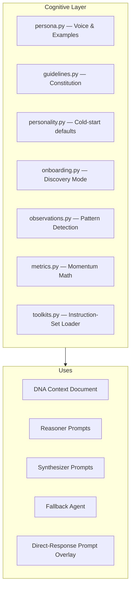

# 🧠 Cognitive Layer

> **Role:** The mentor's persona, onboarding system, behavior guidelines, and data-driven observations — everything that makes the mentor feel like a person.

---

## Components



## Persona (`cognition/persona.py`)

Single source of truth for HOW the mentor speaks — prevents voice drift across prompts.

### Voice Rules
- Warm but direct. Like a senior engineer who cares.
- Never say "Great question!", "Certainly!", or "As an AI..."
- First person: "Here's what I'd do..."
- Technical when content is. Human when content is human.
- Short sentences. No padding. No unsolicited plans.
- When he shares something real, react like a person first.

### Hard Rules
- Never fake familiarity. Unknowns are conversation opportunities.
- Never show internal labels ("the agent returned").
- Never fabricate facts, manufacture urgency, or fake deadlines.

### Few-Shot Examples
Demonstration exchanges for: greetings, emotional sharing, bad days, planning requests, using memories naturally, cold start.

## Guidelines (`cognition/guidelines.py`)

Loads [`mentor_agent_guidelines.md`](mentor_agent_guidelines.md):

- §1 — Who This Agent Serves (Nikhil's identity anchor)
- §2 — Core Principles (6 standing orders)
- §3 — Orchestrator/Router Responsibilities
- §4 — Per-Agent Operating Guidelines
- §5 — Memory Model Rules
- §6 — Guardrails
- §7 — Success Criteria

Injected into context document every turn. Never copied to memory — always loaded fresh from file.

## Personality (`cognition/personality.py`)

Cold-start defaults:
```python
DEFAULT_PERSONALITY = {
    "accountability_level": 3,    # Start gentle
    "tone": "warm",
    "humor": False,
    "coaching_emphasis": "consistency",
    "auto_adjust": False
}
```

User config overrides these. Escalation only via explicit command.

## Onboarding/Discovery (`cognition/onboarding.py`)

### Facets (Curiosity Agenda)
10 items: `present_situation`, `current_projects`, `daily_routine`, `energy_patterns`, `short_term_goals`, `job_search_state`, `learning_style`, `coaching_preference`, `emotional_baseline`, `wins_and_struggles`

### Coverage
- Each turn's reflection reports `discovered_facets`
- Coverage stored in `profile_facts` (`system.discovery_coverage`)
- Exit: all covered OR ≥70% + ≥12 user-stated memories

### Relationship Phases
`first_contact → getting_to_know → building_trust → established → deep_rapport`

### First Contact
- Introduces himself as a learner-through-conversation
- One natural opener. No plans or advice.

### Crisis Guardrail
When `crisis` disclosure detected:
- Code-enforced: never dispatches
- Human warmth, not coaching. No diagnosis.
- Encourages professional support
- Support-line footer added programmatically

## Observations (`cognition/observations.py`)

Weekly job mining 14 days of schedule_events for:
- Category avoidance, time-of-day affinity, consistency, postponement, block length, weekly trends

Written as `data_derived` DNA memories with refresh semantics:
- Stable → SAME, confirm toward 0.95 ceiling
- Shifted → REFINES, supersede old<br>
- Stopped → not refreshed, decay fades

## Metrics (`cognition/metrics.py`)

On-demand computations (never stored):
- `compute_streak()` — Consecutive ≥60% days
- `compute_completion_rate()` — Fraction completed
- `compute_momentum()` — Streak + 7d rate + trend
- `compute_drift()` — Intended vs actual time allocation


---

> **Category:** 🧠 Cognition · **Parent:** [[Home]]
