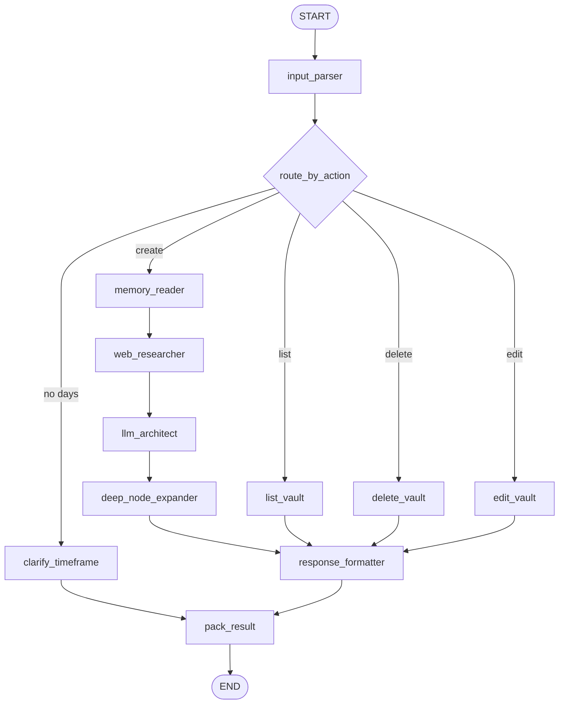

# 🎯 Goal Decomposer Agent

> **Role:** Decomposes high-level learning goals into structured, dependency-aware topic graphs saved as Markdown files in the Obsidian vault.

---

## 2-Phase Generation Architecture



## Phase 1 — Architect (`llm_architect`)

**Input:** Learning goal + optional web research context  
**LLM:** Generates `GoalDecompositionOutline` with:
- `graph_title` — Overall roadmap title
- `total_days` — Number of days planned
- `subtopics` — List of `SubTopicOutline`, each with:
  - `title`, `estimated_hours`, `day`, `prerequisite_titles`
  - `content_type` — One of 4 content buckets:
    - `conceptual` — Theory, architecture, mental models
    - `algorithmic` — DSA, complexity analysis, pseudocode
    - `hands_on_code` — Practical tool/API tutorials with code
    - `reference` — Quick lookup, comparison tables
  - `what_to_cover` — Summary of key concepts
- `summary_notes` — Strategy notes

DAG validation: Uses `networkx` to verify no cycles and compute critical path.

## Phase 2 — Deep Node Expander (`deep_node_expander`)

For each subtopic, runs content-type-aware parallel generation:

| Content Type | Writer Prompt Focus | Fields |
|-------------|-------------------|--------|
| `conceptual` | Understanding & judgment | `concept_overview`, `tradeoffs_and_comparisons`, `common_misconceptions`, `reflection_prompt` |
| `algorithmic` | Problem-solving | `concept_overview`, `approach_breakdown`, `pseudocode_or_code`, `complexity_analysis`, `common_pitfalls`, `practice_problem` |
| `hands_on_code` | Practical building | `concept_overview`, `code_example`, `common_pitfalls`, `hands_on_challenge` |
| `reference` | Quick lookup | `concept_overview`, `comparison_table`, `canonical_usage`, `common_pitfalls` |

Uses `ThreadPoolExecutor` for parallel generation + web search per node.

### Quality Validation

Each generated tutorial is validated:
- Minimum 800 characters
- No lazy placeholders (`...`, `TODO`, `TBD`)
- At least 2 markdown headings

## Output: Obsidian Vault Files

Every roadmap gets its own folder in the vault:

```
Learning/Topics/<Graph Title>/
├── <Graph Title> Roadmap.md   (index with day-by-day overview)
├── <Node Title>.md            (one file per subtopic)
└── ...
```

Files include YAML frontmatter with `id`, `graph_id`, `prerequisites`, `day`, `status`, `estimated_hours` — enabling Obsidian's graph view to show the DAG topology.

## Memory Delta

Updates `topic_graphs` in `profile_facts` with the new graph + updates `learning_log` with the decomposition event.


---

> **Category:** 🤖 Agent · **Parent:** [[Agent IO Contract]]
