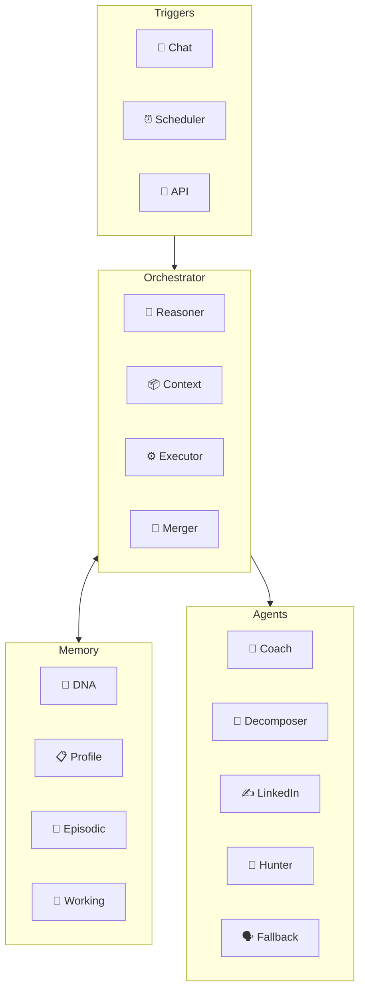

# 🧠 Personal AI Mentor — Documentation Vault

> **A local-first, multi-agent AI companion/mentor system for Nikhil.**
> Built with LangGraph, PostgreSQL (pgvector), ChromaDB, and Obsidian.

---

## 🏗️ System Architecture

---

## 📚 Entry Points (curated — 7 hub pages)

Start here for a top-down understanding. Each hub links to its sub-docs.

### 🔄 Core Flow
- [[Architecture Overview]] — System design, principles, data flow
- [[Orchestrator Pipeline]] — LangGraph state graph, nodes, routing

### 🧬 Memory
- [[Memory System Overview]] — 4-tier hybrid memory architecture

### 📐 Contracts
- [[Agent IO Contract]] — AgentTask / AgentResult sealed envelope

### 🧠 Mentoring Layer
- [[Cognitive Layer]] — Persona, guidelines, onboarding, observations
- [[Repo-to-Curriculum Blueprint]] — The target product: repo → prerequisite curriculum → Socratic teaching *(plan)*

### ⚙️ Infrastructure
- [[LLM Strategy]] — 3-tier model selection (Router / Converser / Writer)

### 🚀 Getting Started
- [[Quickstart Guide]] — Setup, configuration, first run

---

## 📁 Quick Reference by Tag

Filter the Obsidian graph view by these tags:

| Tag | Documents |
|-----|-----------|
| `#architecture` | Architecture, Pipeline, Decisions, Project Structure |
| `#memory` | Memory System, DNA Memory, Data Models, Schemas |
| `#agent` | Daily Coach, Goal Decomposer, LinkedIn Writer, Job Hunter, Fallback |
| `#infrastructure` | LLM Strategy, API, Commands, Tracing, Cognitive Layer |
| `#reference` | Quickstart, Challenges, Design Notes, Implementation Guide |

---

## 🔗 Cross-Cutting Concepts

| Concept | Key Document |
|---------|-------------|
| Stateless agents, stateful memory | [[Architecture Overview]] |
| Memory-slice contract | [[Agent IO Contract]] |
| Confidence lifecycle | [[Memory System Overview]] |
| Multi-agent pipeline chaining | [[Orchestrator Pipeline]] |
| Constraint enforcement | [[Architecture Overview]] |
| Crisis guardrail | [[Cognitive Layer]] |
| Discovery mode | [[Cognitive Layer]] |

---

## 📁 Pre-existing Source Documents (external — not in graph)

- [`📄` mentor_agent_guidelines.md](../mentor_agent_guidelines.md) — Operating constitution (§1–§7)
- [`📄` mentor_persona.md](../mentor_persona.md) — The mentor's voice and hard rules
- [`📄` Mentor Constitution.md](Mentor%20Constitution.md) — What the constitution holds and why
- [`📄` BRANCHES.md](../BRANCHES.md) — This branch is the project; the TypeScript spike is archived beside it
- [`📄` DNA Memory Redesign v2.md](DNA%20Memory%20Redesign%20v2.md) — DNA v2 design doc
- [`📄` CLAUDE Project Context.md](CLAUDE%20Project%20Context.md) — AI assistant context
- [`📄` Original System Architecture.md](Original%20System%20Architecture.md) — Original architecture
- [`📄` Original Bug Journal.md](Original%20Bug%20Journal.md) — Bugs found the hard way
- [`📄` originals/ai-mentor-architecture.md](originals/ai-mentor-architecture.md) — The first architecture sketch
- [`📄` originals/Notes.md](originals/Notes.md) — Cold-start design notes
- [`📄` README.md](../README.md) — Project README

> Last updated: 2026-08-22
