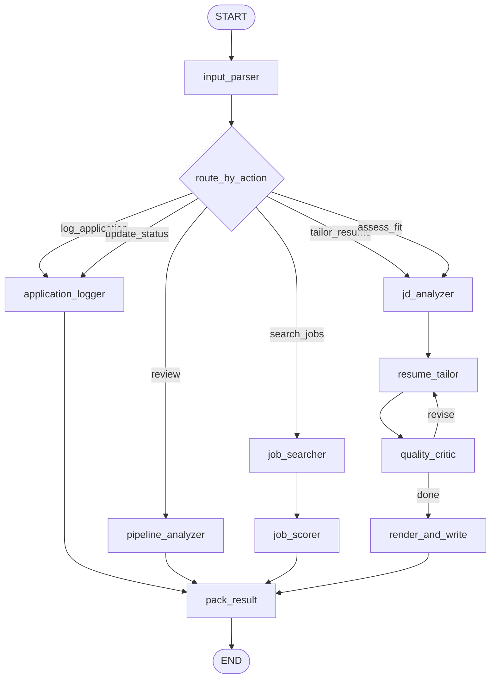

# 💼 Job Hunter Agent

> **Role:** The job-application specialist — tailors resumes to specific JDs, tracks the application pipeline, and searches for jobs.

---

## Graph Topology

Six branches, one LangGraph graph:

## Three-Layer Resume Architecture

A foundational design decision: three layers, each with a clear boundary.

| Layer | What | Who Edits | Format |
|-------|------|-----------|--------|
| **1** — Master Resume | Source of truth, all bullets | Human | `Career/master_resume.yaml` |
| **2** — TailoredResumeDraft | Bullet selections by ID + light rephrasing | LLM (only!) | Pydantic model, code-validated |
| **3** — Rendered PDF | Final LaTeX output | Code (Jinja2 → tectonic) | `.tex` → `.pdf` |

### Layer 2 Honesty Guard

**Every number in a tailored bullet must exist verbatim in its source bullet.** This is enforced programmatically in `quality_critic` — not left to LLM judgment. The `metric_violations()` function in `render.py` checks each generated number against the original master bullets.

## Task Types

| Task Type | Branch | Description |
|-----------|--------|-------------|
| `tailor_resume` | Tailor | JD analysis → bullet selection → render PDF |
| `log_application` | Logger | Log new application (dedup: re-add = refresh) |
| `update_application_status` | Logger | Move pipeline entry to new stage |
| `job_search_review` | Review | Pipeline funnel analysis, stale detection |
| `assess_fit` | Tailor | JD fit analysis without full tailoring |
| `search_jobs` | Search | Multi-source job search + scoring |

## Application Pipeline

The `job_pipeline` in `profile_facts` is the single source of truth for tracked applications. Key design:

- **Dual-key write**: Each mutation writes `job_pipeline` (current state → profile_facts) and one `applications` row (append-only timeline → episodic_events)
- **Stale detection**: Applications silent for 14+ days flagged as stale
- **Stage model**: `wishlist → applied → screening → interviewing → offer → rejected/withdrawn`
- **Dedup**: Re-logging the same company+role refreshes the existing entry

## Job Search

Multi-source job search (`integrations/job_search.py`):

| Source | API Key Required | Coverage |
|--------|-----------------|----------|
| SerpApi (Google Jobs) | Yes | Naukri, InstaHyre, LinkedIn India, Wellfound |
| JSearch (RapidAPI) | Yes | LinkedIn, Indeed, ZipRecruiter |
| ATS Direct | No | Greenhouse/Lever for target companies |

Results are scored and ranked, with the top entries written to the pipeline as `wishlist` stage items.

## Search Scoring

Each result is scored on:
- **Role match** — keyword overlap with target roles
- **Location match** — preferred locations and remote status
- **Seniority fit** — appropriate level for current experience
- **Company relevance** — predefined target companies get a boost

## Verification

`uv run python scripts/tests/test_job_hunter.py` — 40+ checks covering:
- Metric guard (number preservation)
- LaTeX escaping
- One-page enforcement
- Offline logger/review flows
- Full end-to-end tailor (auto-skips without API keys)

---

> **Category:** 🤖 Agent · **Parent:** [[Agent IO Contract]]
