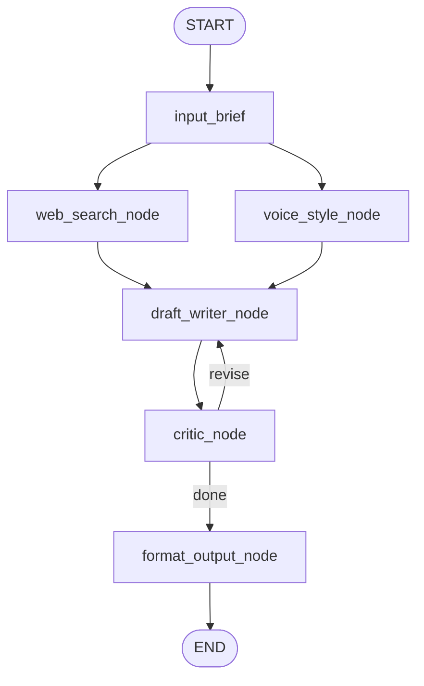

# ✍️ LinkedIn Writer Agent

> **Role:** Drafts LinkedIn posts with a draft-critic-revise loop, voice matching from past posts, and programmatic constraint enforcement.

---

## Graph Topology

## Node Descriptions

| Node | LLM? | Tool? | Responsibility |
|------|------|-------|---------------|
| `input_brief` | ✅ | — | Unpacks AgentTask into topic/goal/audience; LLM-assisted extraction if params missing |
| `web_search_node` | ✅ | TavilySearch | Searches for current facts/trends on the topic; distills into bullet points |
| `voice_style_node` | — | ChromaDB RAG | Queries vectorstore of past posts for topically similar examples to match voice |
| `draft_writer_node` | ✅ | — | Writes or revises the post; on revisions, critic feedback is injected as **dedicated second system message** |
| `critic_node` | ✅ | — | LLM editor reviews draft + **programmatic** checks for `max_length` and `avoid_topics` |
| `format_output_node` | — | — | NFKC normalization, packages into `AgentResult` |

## Revision Loop

**Max 3 revisions.** The critic checks:
- **Length** — Programmatic character count (LLMs are unreliable at this)
- **Avoid topics** — Semantic LLM check + lexical substring fallback
- **Voice/style** — Matches past-post examples
- **Truthfulness** — No fabricated credentials or external claims

If the critic hasn't approved after 3 rewrites:
- Last draft is accepted
- Status = `partial` (or `failed` if draft writer itself failed)
- Critic's final feedback included in error_message

## Key Bug Fixes (Historical)

From `challenges.md` and `CLAUDE.md`:

1. **Revision loop wasn't revising** — Fixed by injecting critic feedback as a **dedicated second system message**, not buried at the bottom of the human prompt
2. **max_length was decorative** — Fixed by programmatic enforcement in critic, overriding LLM "APPROVED" verdict
3. **Draft writer fabricated credentials** — Fixed by explicitly forbidding external survey/study citations
4. **avoid_topics matching** — Fixed with both semantic LLM check and lexical humanized-token fallback
5. **Silent LLM exceptions** — Fixed with explicit failure tagging: `[AUTO-APPROVED: ...]` and `[DRAFT_FAILED: ...]` markers
6. **status always "success"** — Fixed by deriving status from actual critic outcome

## Constraint Enforcement

| Constraint | How Enforced |
|-----------|-------------|
| `max_length` | `len(draft) > max_length` → programmatic override of LLM approval |
| `avoid_topics` | Semantic LLM check + lexical substring against humanized tokens |
| Voice/style | RAG comparison with past posts |
| Truthfulness | Prompt-level rule + critic verification |

## RAG Setup

The Chroma vectorstore (`chroma_store/linkedin_voice/`) indexes past LinkedIn posts. Loaded at module import time to avoid per-request rebuild latency. `_load_or_build_vectorstore()` in `RAG.py` handles first-build if the store doesn't exist.

---

> **Category:** 🤖 Agent · **Parent:** [[Agent IO Contract]]
