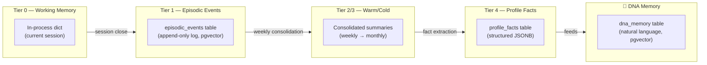

# 🧠 Memory System Overview

> **Role:** The 4-tier hybrid memory architecture that gives the mentor persistent continuity across sessions.

---

## Architecture

The memory system is the mentor's long-term brain. Everything the mentor knows about Nikhil lives here — nothing is hardcoded beyond the §1 anchor facts in `mentor_agent_guidelines.md`.

## Tier Breakdown

### Tier 0 — Working Memory

- **What:** Current conversation session's live state
- **Implementation:** LangGraph checkpointer (`PostgresSaver` / `SqliteSaver`)
- **Lifecycle:** Ephemeral — gets summarized into episodic memory when a session ends
- **Access:** All orchestrator nodes

### Tier 1 — Episodic Events

- **What:** Append-only log of everything that happened
- **Table:** `episodic_events` in PostgreSQL
- **Columns:** `id`, `occurred_at`, `source_agent`, `event_type`, `tags`, `content`, `payload` (JSONB), `embedding` (pgvector 384-dim), `importance`, `consolidated`, `archived`
- **Access:** Summarize node reads last 14 days; retriever searches warm/cold via pgvector
- **Event types:** `conversation_turn`, `daily_plan`, `learning_session`, `job_application`, `linkedin_draft`, `agent_run`, `memory_op`, `weekly_summary`, `monthly_summary`

### Tier 2/3 — Warm/Cold Memory

- **What:** Consolidated summaries of older episodic events
- **Process:** Weekly consolidation job runs 3 stages:
  1. **Weekly consolidation** — Groups events by ISO week, LLM writes 2-3 sentence summary, marks originals as `consolidated=True`
  2. **Monthly consolidation** — Groups weekly summaries by month, LLM writes monthly abstract, marks weeklies as `archived=True`
  3. **Fact extraction** — LLM identifies stable facts from monthly summaries → promotes to `profile_facts`
- **Access:** Only via `MemoryRetriever.recall()` (semantic search), triggered when reasoner sets `needs_long_term_context=True`

### Tier 4 — Profile Facts

- **What:** Stable structured data about Nikhil
- **Table:** `profile_facts` in PostgreSQL
- **Columns:** `id`, `category`, `key`, `value` (JSONB), `updated_at`, `source`
- **Categories:** `identity`, `career`, `education`, `goals`, `skills`, `preferences`, `projects`, `learning`, `system`
- **Access:** Direct key-value read by `summarize_node` and `context_builder_node`

## 🧬 DNA Memory (Cross-Cutting)

The DNA memory layer (`dna_memory` table) stores natural-language facts with a full confidence lifecycle:

| Source | Starting Confidence | Ceiling | User-Confirmed? |
|--------|-------------------|---------|-----------------|
| `user_stated` | 0.95 | 1.0 | True |
| `seeded` | 0.95 | 1.0 | True |
| `data_derived` | 0.70 | 0.95 | False |
| `mentor_inferred` | 0.40 | 0.60 | False |

See [[DNA Memory System]] for full details.

---

> **Category:** 🧬 Memory · **Parent:** [[Home]]