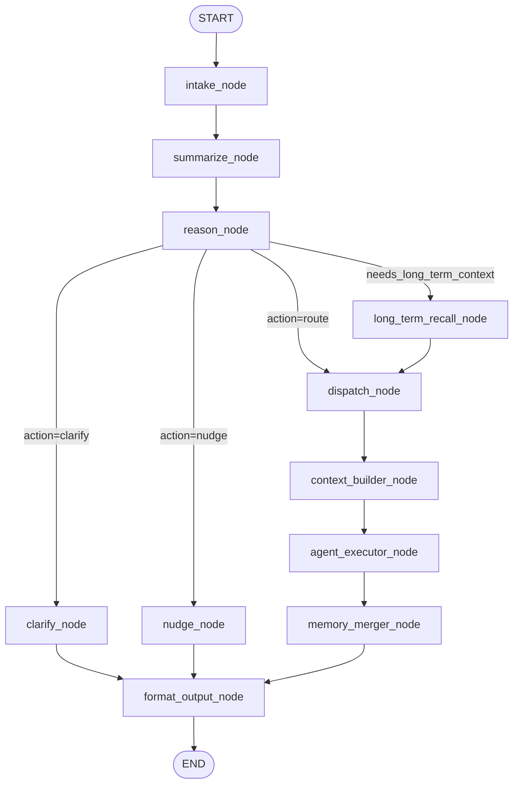

# 🔄 Orchestrator Pipeline

> **Role:** The LangGraph state graph that drives the mentor's reasoning loop — the core orchestration pipeline.

---

## Graph Topology

The orchestrator is a LangGraph `StateGraph` with conditional routing. A full turn flows like this:

## Node Descriptions

| Node                    | DB?   | LLM? | File                       | Responsibility                                                                                  |
| ----------------------- | ----- | ---- | -------------------------- | ----------------------------------------------------------------------------------------------- |
| `intake_node`           | —     | —    | `orchestrator.py`          | Injects `user_input`, bumps `turn_count`, resets stale fields                                   |
| `summarize_node`        | READ  | —    | `orchestrator.py`          | Calls `build_dna_context()` → compact context document with profile, memories, transcript       |
| `reason_node`           | —     | ✅    | `nodes/reasoner.py`        | Structured LLM output → `ReasoningDecision` (action + routing + flags)                          |
| `long_term_recall_node` | READ  | —    | `orchestrator.py`          | `MemoryRetriever.recall()` — pgvector cosine search on warm/cold tiers                          |
| `clarify_node`          | —     | —    | `orchestrator.py`          | Extracts `clarifying_question` from decision, sets `response_text`                              |
| `nudge_node`            | —     | —    | `orchestrator.py`          | Extracts `proactive_message` from decision, sets `response_text`                                |
| `dispatch_node`         | —     | —    | `orchestrator.py`          | Resolves `agent_name` + `task_type` from decision (keyword fallback if needed)                  |
| `context_builder_node`  | READ  | —    | `nodes/context_builder.py` | Targeted DB read per-agent schema → assembles `AgentTask` with DNA retrieval block              |
| `agent_executor_node`   | —     | ✅    | `orchestrator.py`          | Looks up agent in [[Agent IO Contract#Registry]] via `get_agent_spec()`, calls `spec.run(task)` |
| `memory_merger_node`    | WRITE | —    | `nodes/memory_merger.py`   | Merges `memory_delta` into profile facts, writes episodic events                                |
| `format_output_node`    | WRITE | ✅    | `orchestrator.py`          | Builds `response_text`, fires async DNA reflection, logs conversation turn                      |

## The Three Conditional Paths

From `reason_node`, the graph branches:

| Condition | Path | When |
|-----------|------|------|
| `needs_long_term_context=True` | → `long_term_recall_node` → `dispatch_node` → ... | Semantic search needed for warm/cold memories |
| `action="ask_clarifying_question"` | → `clarify_node` → `format_output_node` → END | Context insufficiency score = 1 |
| `action="proactive_nudge"` | → `nudge_node` → `format_output_node` → END | Proactive check-in or nudge |
| `action="route"` (default) | → `dispatch_node` → ... → END | Normal agent routing |

## Multi-Agent Pipeline Chaining

The orchestrator supports chaining multiple agents in a **single turn** via the `agent_pipeline` field in `OrchestratorState`:

1. `reason_node` sets `agent_pipeline: ["goal_decomposer", "job_hunter"]` (or a single-step skill for planning/logging)
2. `dispatch_node` routes to the first agent
3. After `memory_merger_node`, a routing function checks `pipeline_step` vs `agent_pipeline`
4. If more steps remain, it loops back to `dispatch_node` with the next agent
5. When all agents complete, it proceeds to `format_output_node`

This enables flows like: "Create a learning roadmap and then search for relevant jobs" → Goal Decomposer creates the DAG → Job Hunter finds matching openings — all in one conversation turn. Routine single-step tasks (plan my day, log learning) are now orchestrator skills handled directly by the harness tool loop.

## Memory Tiers Used Per Node

| Tier | What | Access Nodes |
|------|------|-------------|
| **Tier 0** — Working memory | Current session dict | All nodes (in-process, not persisted) |
| **Tier 1** — Recent episodic | Last 14 days, full detail | `summarize_node` |
| **Tier 2/3** — Warm/cold | Consolidated summaries, 2+ weeks old | `long_term_recall_node` (conditional) |
| **Tier 4** — Profile facts | Stable structured data | `summarize_node`, `context_builder_node` |

## Design Rules

1. **Only the orchestrator touches Postgres.** Sub-agents are stateless.
2. **Long-term recall is conditional, not automatic.** Only runs when `reason_node` sets `needs_long_term_context=True`.
3. **Conversation turns are always logged.** `format_output_node` calls `log_conversation_turn()` every turn.
4. **Agents never fail silently.** `agent_executor_node` wraps calls in try/except; a failed agent produces `AgentResult(status=FAILED)`.

---

> **Category:** 🔄 Orchestrator · **Parent:** [[Architecture Overview]]